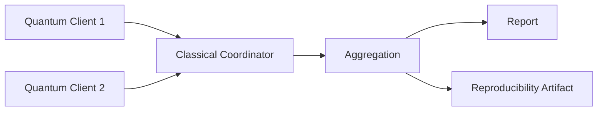

# qfl-mini


A minimal execution sandbox for federated quantum-classical workloads.

## What is qfl-mini?

qfl-mini is a small Python prototype that demonstrates how multiple quantum-capable clients can execute local quantum circuits while a classical coordinator aggregates their results.

Each quantum client owns a local parameter and runs a simple PennyLane circuit. The coordinator collects outputs, applies mean aggregation, and drives repeated rounds or parameter updates. Artifact-producing examples write timestamped JSON files that record the run trace and environment metadata so executions can be inspected and reproduced later.

The project is intentionally small. It is a research-infrastructure seed, not a framework. The goal is to make the basic execution, observation, and reproducibility path clear before larger federated quantum infrastructure is introduced.

## Why this exists

Before Quantum Federated Learning can scale, we need simple ways to execute, observe, and reproduce federated quantum-classical workloads. qfl-mini explores the smallest working building blocks for that direction: local circuit execution, classical coordination, mean aggregation, loss tracking, and reproducibility artifacts.

## What this is not

- not a Quantum OS
- not a full Quantum Federated Learning framework
- not a production system
- not a replacement for PennyLane, Qiskit, Flower, Braket, or Cirq
- not connected to real quantum hardware yet
- not FedAvg
- not dataset-based training
- not an experiment tracking platform

## Core ideas

**Quantum Client** — a local execution node. In this prototype, a Python object with a local parameter and a PennyLane circuit.

**Classical Coordinator** — collects client outputs, applies aggregation, and drives repeated rounds or parameter updates.

**Federated Quantum Workload** — a computation where multiple quantum-capable clients execute local circuits and a classical coordinator aggregates results without centralising all computation in one quantum process.

**Execution Sandbox** — a controlled environment for trying coordination patterns before adding networking, backend adapters, or hardware execution.

**Aggregation** — combining client results. Currently mean aggregation only.

**Objective / Loss Tracking** — each parameter update round computes a simple squared loss so progress is observable.

**Reproducibility Artifact** — a timestamped JSON file containing the run trace and environment metadata.

**Run ID** — a unique identifier derived from the example name and a UTC timestamp. The artifact filename matches the run ID so repeated runs never overwrite each other.

See [docs/concepts.md](docs/concepts.md) for fuller explanations.

## Architecture overview



Clients run local PennyLane circuits. The coordinator aggregates outputs. Reports make results readable; artifacts make them reproducible.

See [docs/architecture.md](docs/architecture.md) for the module layout and execution flow.

## Example progression

| Example                   | Purpose                                                      | Writes artifact? |
| ------------------------- | ------------------------------------------------------------ | ---------------- |
| `run_two_clients.py`      | Minimal one-round federated quantum execution                | No               |
| `run_multi_round.py`      | Repeated coordination with JSON artifact export              | Yes              |
| `run_parameter_update.py` | Heuristic parameter update with objective/loss tracking      | Yes              |
| `run_gradient_update.py`  | Finite-difference gradient update with reproducible artifact | Yes              |

## Installation

```bash
pip install -r requirements.txt
```

## Run examples

```bash
python examples/run_two_clients.py
python examples/run_multi_round.py
python examples/run_parameter_update.py
python examples/run_gradient_update.py
```

Artifact-producing examples write timestamped JSON files under `runs/`.

## Example output

```text
qfl-mini: finite-difference gradient update demo

Rounds:
- round 1 | theta=0.500000 | loss=0.770151 | gradient=-0.841470 | next_theta=0.584147
- round 2 | theta=0.584147 | loss=0.695861 | gradient=-0.920083 | next_theta=0.676155
- round 3 | theta=0.676155 | loss=0.608376 | gradient=-0.976226 | next_theta=0.773778

Final theta:
0.773778
Saved artifact: runs/run_gradient_update_<timestamp>.json
```

## Reproducibility artifacts

Each artifact-producing example writes a JSON file under `runs/` with a unique `run_id`. The filename matches the `run_id`, so repeated runs do not overwrite each other.

Artifacts include:

- project name and artifact version
- run ID and timestamp
- example name
- environment metadata (Python version, platform, PennyLane version)
- full run trace

Example shape:

```json
{
  "project": "qfl-mini",
  "artifact_version": "0.1",
  "run_id": "run_gradient_update_20260516T205502Z",
  "created_at": "2026-05-16T20:55:02Z",
  "example": "run_gradient_update",
  "environment": {
    "python_version": "3.12.6",
    "platform": "...",
    "pennylane_version": "0.45.0"
  },
  "run": {
    "num_rounds": 3,
    "epsilon": 0.001,
    "final_theta": 0.773778
  }
}
```

This is intentionally lightweight. qfl-mini does not implement a full experiment tracking system.

## Development checks

```bash
pip install -r requirements-dev.txt
pytest
python -m compileall qflmini examples
```

## Current status

Alpha research-infrastructure seed. Phase 0 and Phase 1 are implemented.

**Implemented:**

- local quantum clients
- PennyLane-based circuit execution
- classical coordinator
- mean aggregation
- one-round execution and report
- multi-round execution
- JSON artifact export
- reproducibility metadata
- run IDs and non-overwriting artifact filenames
- heuristic parameter update demo
- objective/loss tracking
- finite-difference gradient update demo

**Not implemented yet:**

- experiment manifests
- backend adapters
- Qiskit / Braket / Cirq support
- real hardware execution
- datasets
- FedAvg
- full QFL training
- dashboard or experiment tracking server

## Roadmap

```text
Phase 0: minimal federated quantum execution
Phase 1: parameter updates, loss tracking, gradient demo, reproducibility artifacts
Phase 2: experiment manifests
Phase 3: backend adapters
Phase 4: noise and backend realism
Phase 5: richer QFL training examples
Phase 6: optional real hardware integration
```

See [docs/roadmap.md](docs/roadmap.md) for the staged roadmap.
