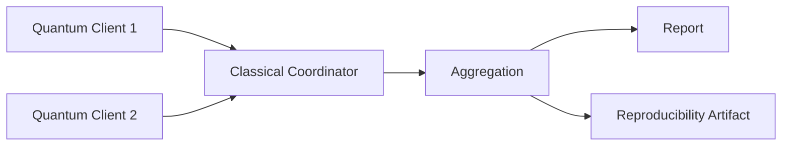

# qfl-mini


[](https://github.com/alisalimi77/QFL/actions/workflows/tests.yml)

A minimal execution sandbox for federated quantum-classical workloads.

## What is qfl-mini?

qfl-mini is a small Python prototype that demonstrates how multiple quantum-capable clients can execute local quantum circuits while a classical coordinator aggregates their results.

Each quantum client owns a local parameter and runs through a small backend interface. The default backend executes a simple PennyLane circuit, while deterministic support backends make comparison examples and tests easier to reproduce. The coordinator collects outputs, applies mean aggregation, and drives repeated rounds or parameter updates. JSON manifests describe supported experiments without editing Python code. Artifact-producing examples write timestamped JSON files that record the run trace, manifest provenance, backend metadata, and environment metadata so executions can be inspected and reproduced later.

The project is intentionally small. It is a research-infrastructure seed, not a framework. The goal is to make the basic execution, observation, and reproducibility path clear before larger federated quantum infrastructure is introduced.

## Start here

For a step-by-step path through the current workflow, see [docs/walkthrough.md](docs/walkthrough.md).

## Why this exists

Before Quantum Federated Learning can scale, we need simple ways to execute, observe, and reproduce federated quantum-classical workloads. qfl-mini explores the smallest working building blocks for that direction: local circuit execution, classical coordination, mean aggregation, loss tracking, and reproducibility artifacts.

## What this is not

- not a Quantum OS
- not a full Quantum Federated Learning framework
- not a production system
- not a replacement for PennyLane, Qiskit, Flower, Braket, or Cirq
- not connected to real quantum hardware yet
- not full FedAvg over model weights
- not dataset-based training
- not PyTorch, Flower, FedML, or a general FL framework
- not a dashboard or server
- not a full optimizer framework
- not automatic-differentiation-based training
- not an experiment tracking platform

## Core ideas

**Quantum Client** — a local execution node. In this prototype, a Python object with a local parameter and a backend that runs a PennyLane circuit.

**Quantum Backend** — the object responsible for running a scalar-theta expectation circuit. `PennyLaneBackend` is the only real quantum backend. `ConstantBackend` is a deterministic test/demo backend that always returns a fixed value. `NoisyBackend` wraps any backend and adds a deterministic perturbation (`noise * sin(theta + seed)`) for controlled comparison experiments. The interface is a small seam for future adapters; it is not a plugin system and adds no new dependencies.

**PennyLaneBackend** — the default backend. It runs the one-qubit PennyLane circuit used by the current examples.

**ConstantBackend** — a deterministic support backend for tests and demos. It returns a fixed value and is not a quantum simulator.

**NoisyBackend** — a deterministic wrapper backend for controlled clean-vs-noisy comparisons. It does not model hardware noise.

**Classical Coordinator** — collects client outputs, applies aggregation, and drives repeated rounds or parameter updates.

**Federated Quantum Workload** — a computation where multiple quantum-capable clients execute local circuits and a classical coordinator aggregates results without centralising all computation in one quantum process.

**Execution Sandbox** — a controlled environment for trying coordination patterns before adding networking, backend adapters, or hardware execution.

**Aggregation** — combining client results. Currently mean aggregation only.

**Objective / Loss Tracking** — each parameter update round computes a simple squared loss so progress is observable.

**Client-Specific Objective** — a local objective context where each client compares its own circuit result against its own target. This is a small step toward federated objective evaluation, not dataset-based learning.

**Transparent Scalar FedAvg** — a minimal FedAvg-style loop over one scalar parameter. Clients compute local finite-difference updates from local objectives, and the server averages the local updated parameters. It is trace-first and not full model-weight FedAvg.

**Experiment Manifest** — a JSON v0.1 file that declares a supported experiment, currently `gradient_update` or `client_objectives`, including optional built-in backend config.

**Reproducibility Artifact** — a timestamped JSON file containing the run trace and environment metadata.

**Artifact Comparison** — a dependency-free plain text comparison of saved artifacts, including manifest names, backend names, backend details, final theta, and final loss.

**Run ID** — a unique identifier derived from the example name and a UTC timestamp. The artifact filename matches the run ID so repeated runs never overwrite each other.

See [docs/concepts.md](docs/concepts.md) for fuller explanations.

## Architecture overview



Clients run local PennyLane circuits. The coordinator aggregates outputs. Reports make results readable; artifacts make them reproducible.

See [docs/architecture.md](docs/architecture.md) for the module layout and execution flow.

## Example progression

| Example                         | Purpose                                                              | Writes artifact? |
| ------------------------------- | -------------------------------------------------------------------- | ---------------- |
| `run_two_clients.py`            | One-round federated quantum execution                                | No               |
| `run_multi_round.py`            | Multi-round coordination                                             | Yes              |
| `run_parameter_update.py`       | Heuristic parameter update + loss tracking                           | Yes              |
| `run_gradient_update.py`        | Finite-difference gradient update                                    | Yes              |
| `run_client_objectives.py`      | Client-specific local objectives and mean local loss                 | Yes              |
| `run_scalar_fedavg.py`          | Transparent scalar FedAvg over a single parameter                    | Yes              |
| `run_from_manifest.py`          | Run a supported experiment from JSON manifest                        | Yes              |
| `compare_artifacts.py`          | Compare saved artifacts                                              | No               |
| `run_custom_backend.py`         | Demonstrate backend injection with `ConstantBackend`                 | No               |
| `run_clean_vs_noisy_backend.py` | Compare clean PennyLane execution with deterministic noisy execution | Yes              |

## Installation

```bash
pip install -r requirements.txt
```

## Run examples

```bash
python examples/run_two_clients.py
python examples/run_multi_round.py
python examples/run_parameter_update.py
python examples/run_gradient_update.py
python examples/run_client_objectives.py
python examples/run_scalar_fedavg.py
```

Artifact-producing examples write timestamped JSON files under `runs/`.

## Run from a JSON manifest

```bash
python examples/run_from_manifest.py examples/manifests/gradient_update.json
```

The manifest describes the experiment declaratively:

```json
{
  "manifest_version": "0.1",
  "name": "default-gradient-update",
  "description": "Default finite-difference gradient update experiment.",
  "experiment": "gradient_update",
  "num_clients": 2,
  "num_rounds": 3,
  "initial_theta": 0.5,
  "learning_rate": 0.1,
  "target": 0.0,
  "epsilon": 0.001
}
```

- `manifest_version` is currently `"0.1"`
- `name` gives each manifest a human-readable identifier visible in artifact comparison output
- `description` documents the manifest's purpose (optional)
- supported experiments are `gradient_update` and `client_objectives`; JSON only
- `backend` is optional; if omitted, it defaults to `{"type": "pennylane"}`

Manifests can select one of qfl-mini's built-in backends:

```json
"backend": {
  "type": "pennylane"
}
```

```json
"backend": {
  "type": "constant",
  "value": 0.5
}
```

```json
"backend": {
  "type": "noisy",
  "base": {
    "type": "pennylane"
  },
  "noise": 0.05,
  "seed": 42
}
```

This is an explicit built-in backend builder, not arbitrary Python imports, a
plugin system, or support for external quantum SDKs.

The `client_objectives` manifest uses local client targets, not datasets:

```json
"clients": [
  {
    "client_id": "client_1",
    "theta": 0.2,
    "target": 0.0
  }
]
```

Several example manifests are provided:

| Manifest                           | Name                       | Backend             | Purpose                        |
| ---------------------------------- | -------------------------- | ------------------- | ------------------------------ |
| `gradient_update.json`             | `default-gradient-update`  | `pennylane` default | Default settings               |
| `gradient_update_low_lr.json`      | `low-learning-rate`        | `pennylane` default | Lower learning rate            |
| `gradient_update_target_half.json` | `target-half`              | `pennylane` default | Non-zero target                |
| `gradient_update_more_rounds.json` | `more-rounds`              | `pennylane` default | More rounds                    |
| `gradient_update_noisy.json`       | `noisy-gradient-update`    | `noisy`             | Deterministic noisy backend    |
| `gradient_update_constant.json`    | `constant-gradient-update` | `constant`          | Deterministic constant backend |
| `client_objectives.json`           | `client-objectives-demo`   | `pennylane`         | Client-specific objectives     |

```bash
python examples/run_from_manifest.py examples/manifests/gradient_update_low_lr.json
python examples/run_from_manifest.py examples/manifests/client_objectives.json
```

## Compare artifacts

After generating artifacts from multiple runs, compare them in one command:

```bash
python examples/compare_artifacts.py runs/file1.json runs/file2.json
```

Example output:

```text
qfl-mini: artifact comparison

run_id                                          manifest                 manifest_file           backend    backend_detail  experiment         primary_metric   primary_value  secondary_metric   secondary_value
run_from_manifest_gradient_update_...           default-gradient-update  gradient_update.json    pennylane  -               gradient_update    final_loss       0.608376       final_theta        0.773778
run_from_manifest_client_objectives_...         client-objectives-demo   client_objectives.json  pennylane  -               client_objectives  mean_local_loss  0.499612       aggregated_result  0.838387
```

Comparison is experiment-aware. For `gradient_update`, the primary metric is `final_loss` and the secondary metric is `final_theta`. For `client_objectives`, the primary metric is `mean_local_loss` and the secondary metric is `aggregated_result`. Backend details are still shown when available. This is a lightweight comparison helper — no dashboard, no database, no plotting.
For direct scalar FedAvg artifacts, the primary metric is `final_mean_local_loss` and the secondary metric is `final_theta`.

## Example output

```text
qfl-mini: finite-difference gradient update demo

Rounds:
- round 1 | theta=0.500000 | loss=0.770151 | gradient=-0.841470 | next_theta=0.584147
- round 2 | theta=0.584147 | loss=0.695861 | gradient=-0.920083 | next_theta=0.676155
- round 3 | theta=0.676155 | loss=0.608376 | gradient=-0.976226 | next_theta=0.773778

Final theta:
0.773778
Saved artifact: runs/run_gradient_update_<timestamp>.json
```

## Reproducibility artifacts

Each artifact-producing example writes a JSON file under `runs/` with a unique `run_id`. The filename matches the `run_id`, so repeated runs do not overwrite each other.

Artifacts include:

- project name and artifact version
- run ID and timestamp
- example name
- environment metadata (Python version, platform, PennyLane version)
- full run trace

Example shape:

```json
{
  "project": "qfl-mini",
  "artifact_version": "0.1",
  "run_id": "run_gradient_update_20260516T205502Z",
  "created_at": "2026-05-16T20:55:02Z",
  "example": "run_gradient_update",
  "environment": {
    "python_version": "3.12.6",
    "platform": "...",
    "pennylane_version": "0.45.0"
  },
  "run": {
    "manifest_path": "examples/manifests/gradient_update.json",
    "backend": {
      "name": "pennylane",
      "class": "PennyLaneBackend"
    },
    "result": {
      "num_rounds": 3,
      "final_theta": 0.773778
    }
  }
}
```

This is intentionally lightweight. qfl-mini does not implement a full experiment tracking system.

## Development checks

```bash
pip install -r requirements-dev.txt
pytest
python -m compileall qflmini examples
```

## Current status

Alpha research-infrastructure seed. Phase 0 and Phase 1 are done; Phase 2 is done/active; Phase 3 and Phase 4 are active; Phase 5 is active; Phase 6 is started.

**Implemented:**

- local quantum clients
- PennyLane-based circuit execution
- classical coordinator
- mean aggregation
- one-round execution and report
- multi-round execution
- JSON artifact export
- reproducibility metadata
- run IDs and non-overwriting artifact filenames
- heuristic parameter update demo
- objective/loss tracking
- finite-difference gradient update demo
- client-specific objective evaluation and mean local loss
- transparent scalar FedAvg with per-round and per-client trace
- JSON manifest v0.1 for gradient update and client objective experiments
- manifest-driven client-specific objective evaluation
- manifest versioning (`manifest_version`) and names (`name`)
- multiple example manifests for `gradient_update` plus `client_objectives.json`
- backend-aware manifest experiments for built-in backends
- dependency-free artifact comparison helper with backend details
- manifest provenance recorded in artifacts (`manifest_path`)
- minimal backend interface (`QuantumBackend` protocol, `PennyLaneBackend`)
- `ConstantBackend` for tests and demos
- `get_backend_metadata()` helper with richer metadata for `ConstantBackend` and `NoisyBackend`
- backend metadata recorded in manifest-run artifacts
- custom backend injection demo (`run_custom_backend.py`)
- `NoisyBackend` — deterministic noisy wrapper (`noise * sin(theta + seed)`, clipped to `[-1.0, 1.0]`)
- clean-vs-noisy backend comparison demo (`run_clean_vs_noisy_backend.py`) with artifact saving
- GitHub Actions CI

**Not implemented yet:**

- external quantum backend adapters
- real hardware execution
- arbitrary backend loading or imports from manifests
- backend plugin system
- YAML manifests
- manifest support beyond `gradient_update` and `client_objectives`
- general config/plugin framework
- dashboard or plotting tools
- Qiskit / Braket / Cirq adapters
- hardware noise models or density-matrix simulation
- stochastic noise
- datasets
- FedAvg over model weights
- vector parameters, local epochs, and client sampling
- PyTorch, Flower, or FedML integration
- full QFL training
- dashboard or experiment tracking server

## Roadmap

```text
Phase 0: minimal federated quantum execution                      [done]
Phase 1: parameter/loss/gradient traces                           [done]
Phase 2: manifest/artifact/comparison workflow                    [done/active]
Phase 3: backend abstraction                                      [active]
Phase 4: deterministic backend realism and backend-aware manifests [active]
Phase 5: client-specific objectives                               [started]
Phase 6: transparent scalar FedAvg                                [started]
```

See [docs/roadmap.md](docs/roadmap.md) for the staged roadmap.
